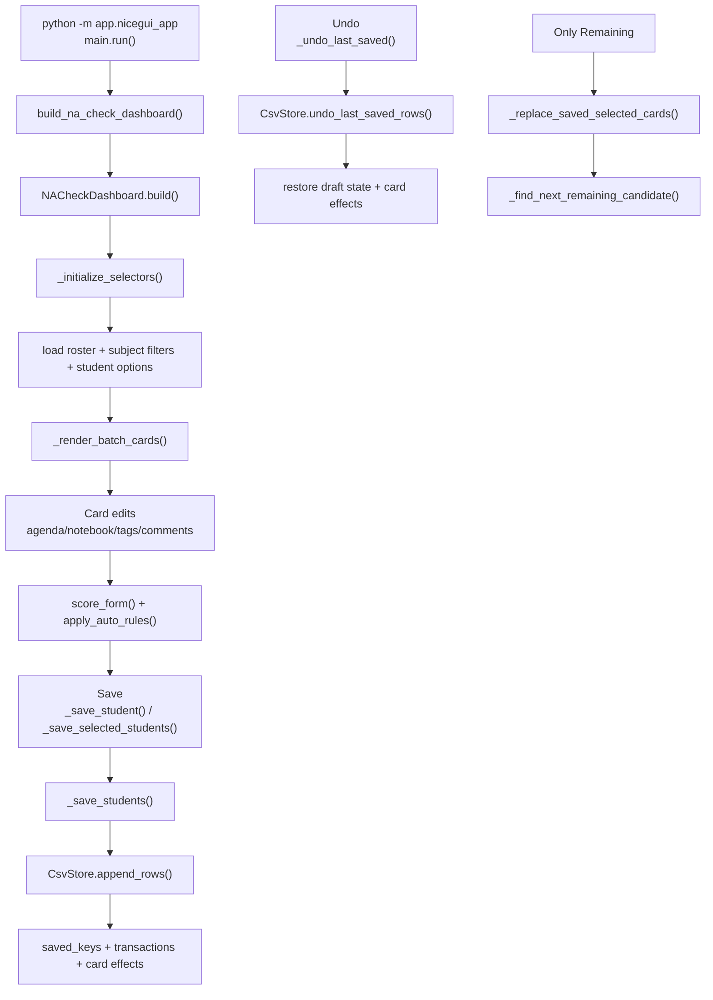
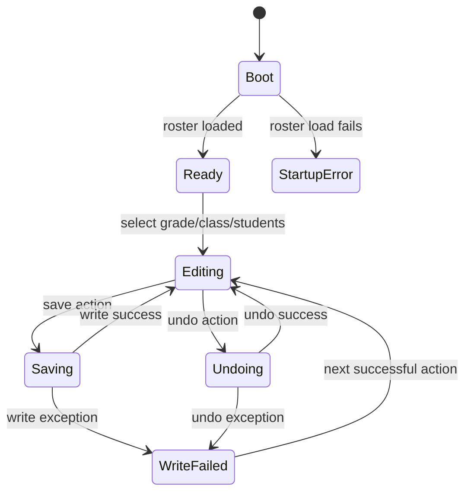
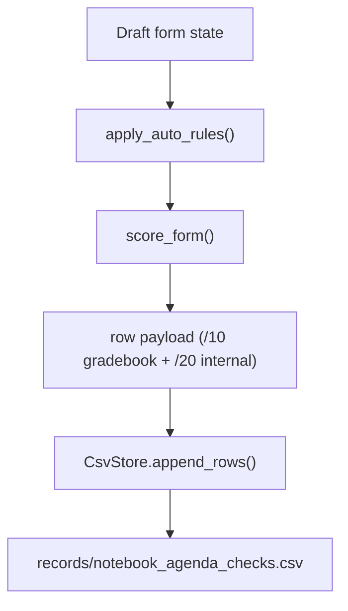

# Application Flowchart

This document maps the active NiceGUI runtime flow to `na_check_dashboard`.

## Overview

### Diagram A - End-to-End Runtime

## UI State

### Diagram B - Dashboard States

## Persistence + Compatibility

### Diagram C - Save Pipeline

Notes:

- `CheckMode` is written as `both`.
- Score model is written as `internal20_gradebook10_v1`.
- Legacy `Period` compatibility is retained in output and history handling.
