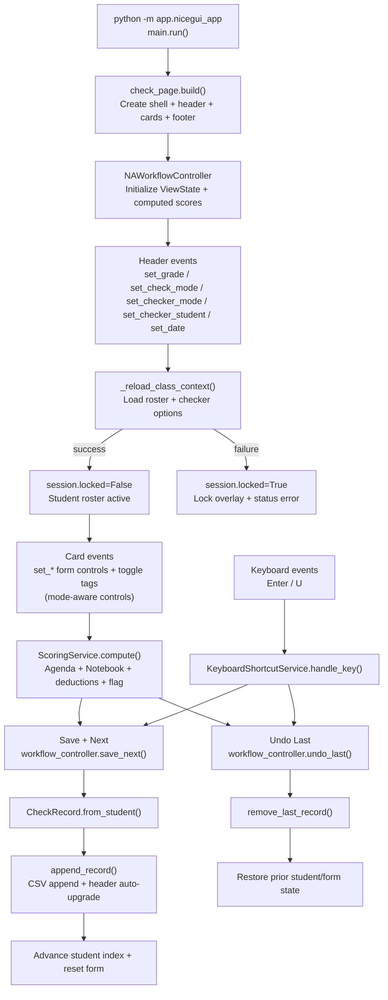
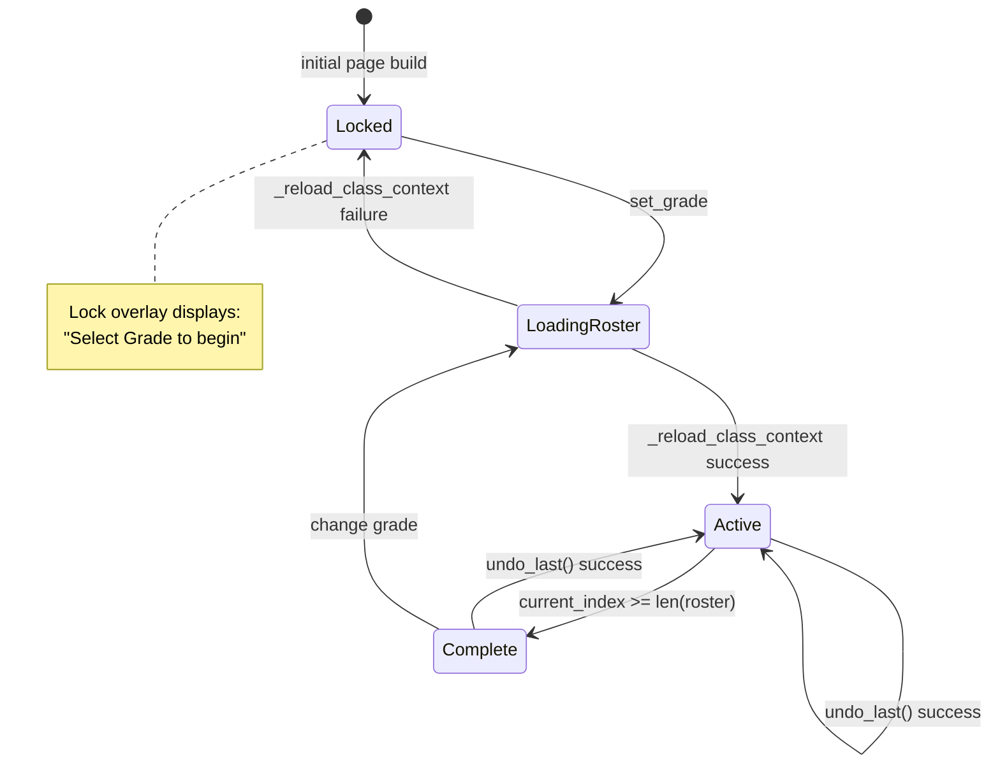
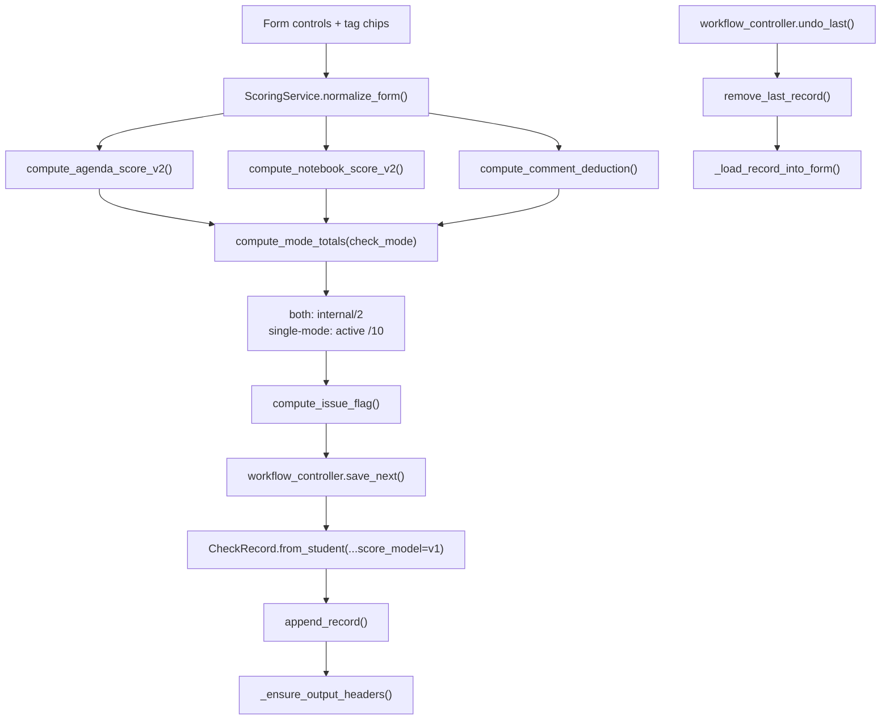
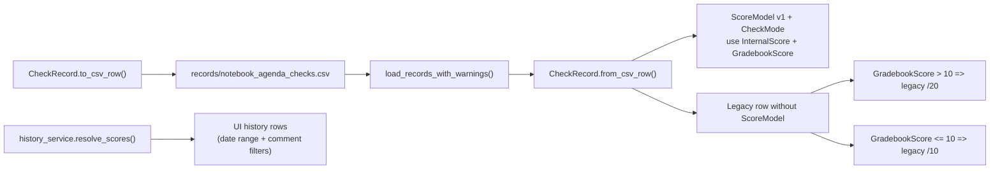

# Application Flowchart

This document maps the active NiceGUI runtime flow to code-level methods and supporting persistence/scoring modules.

## Overview

### Diagram A - End-to-End Overview

## UI State Machine

### Diagram B - UI Lifecycle and State Transitions

## Scoring + Persistence

### Diagram C - Scoring, Save, and Undo Pipeline

### Diagram D - Data Model and CSV Compatibility

## UI QA Checklist

Verify at `1366x768`:

- No vertical page overflow in the default dashboard view.
- Sticky topbar and sticky footer remain visible.
- Student strip appears as a separate rounded row under the topbar.
- `both` mode shows 3 cards; single modes show 2 cards with equal heights.
- Card bottom score strips stay pinned and chips wrap cleanly.

Verify at `1024px` width:

- Cards stack to a single column.
- Footer summary/actions remain visible and usable.
- Chip rows continue to wrap cleanly.
- Keyboard focus states are visible on fields, chips, and buttons.
